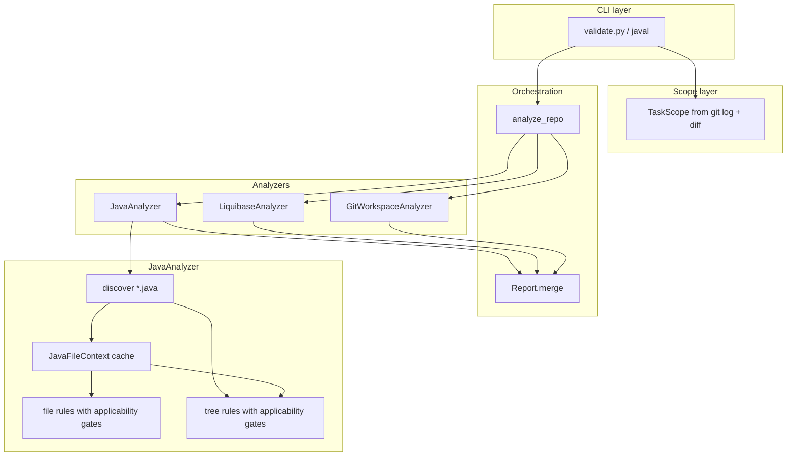

# javal — specification and architecture

This document is the canonical reference for how `javal` works: purpose, concepts, assumptions, architecture, and extension points. For install, usage examples, and CLI flags, see [README.md](README.md).

## Purpose

`javal` is a task-scoped static-analysis CLI for Java (and related) repositories. It validates **only lines added or changed in task commits** on the current branch, not the full codebase history.

It complements [me-ai-coder](https://github.com/JakubKamarski/ai-coder), which owns agent rules, skills, and specs. `javal` enforces those policies mechanically at validation time.

Primary consumers:

- Developers finishing a task branch
- AI agents running a mandatory validation gate before merge

## Core concepts

### Task

A **task** is identified by a Jira-style id (`ABC-1234`). Commits whose subject starts with `<TASK-ID> |` belong to that task.

### Task scope

**Task scope** is the set of line numbers added or modified in task commits, keyed by absolute file path. File-level Java rules report findings only when the violation line is in task scope. Tree-level rules apply their own scope policies (see below).

### Check

A **check** (also **rule**) is a single validation concern with a stable `check_id` (e.g. `unused-imports`). Checks produce **findings**.

### Finding

A **finding** is one reported issue: severity, check id, summary, file path, line number, optional details and suggestion. Findings with severity `error` or `warning` and a non-empty file path are **invalid** and cause a non-zero exit code.

### Analyzer

An **analyzer** inspects one domain of the repository (Java sources, Liquibase changelogs, git workspace). Analyzers implement a common protocol and return a `Report`. The top-level orchestrator merges analyzer reports.

### File rule vs tree rule

| Kind | Scope | Interface | Examples |
|------|-------|-----------|----------|
| **File rule** (`JavaRule`) | One `.java` file at a time | `apply(context) -> list[RuleViolation]` | unused imports, naming, comments |
| **Tree rule** (`TreeJavaRule`) | Repository tree (subset of paths) | `apply_tree(java_files, scope, contexts) -> list[Finding]` | missing test class, duplicate IT/Test, entity serialVersionUID |

### Applicability

**Applicability** decides whether a rule runs on a given file path before `apply()` or `apply_tree()` is called. Values: `any`, `test`, `main`, `production`. See [Rule applicability](#rule-applicability).

### Production / test / main source

Path classification lives in `validator/java/source_paths.py`:

- **Test source** — under `src/test/java`, or filename ends with `*Test` / `*IT` (with `*ITTest` excluded as unit-test naming)
- **Main source** — under `src/main/java`
- **Production source** — not test; either main source or a fixture path without `src` in the path (used for unit-test fixtures)

## Assumptions

1. **Git repository** — the target path resolves to a git work tree. Task scope and Liquibase author checks depend on git history and config.
2. **Task commit message format** — commits use `<TASK-ID> | <message>` (regex: `^[A-Z][A-Z0-9]*-\d+$` for the id).
3. **Branch contains task commits** — validation runs against commits reachable from the current branch matching the task id prefix.
4. **UTF-8 sources** — Java and XML files are read as UTF-8.
5. **Maven/Gradle layout** — `src/main/java` and `src/test/java` conventions are assumed for path-based applicability and test-class resolution.
6. **Agents use the `javal` binary** — not `validate.py` directly; the installed CLI is the supported entry point.
7. **Policy source of truth is external** — naming, testing, JPA, and sanitize rules are defined in me-ai-coder agent rules; `javal` implements enforceable subsets.
8. **Warnings fail the gate** — both `error` and `warning` severities are invalid findings unless explicitly handled via `javal todo` for confirmed false positives.

## Architecture overview



### Repository layout

```
me-javal/
├── validate.py              # CLI entry (installed as `javal`)
├── spec.md                  # This document
├── fixtures/java/           # Anonymized rule fixtures for pytest
├── tests/                   # Unit and git-integration tests
└── validator/
    ├── analyze.py           # Top-level analyzer orchestration
    ├── analyzer_protocol.py # Analyzer protocol
    ├── analyzer_base.py     # Shared task-scope helpers
    ├── discovery.py         # File discovery (skip build dirs)
    ├── git_scope.py         # TaskScope construction from git
    ├── git_workspace.py     # Uncommitted changes check
    ├── report.py            # Finding, Report, output formats
    ├── liquibase/           # Liquibase changelog analyzer
    └── java/
        ├── analyzer.py      # Java file + tree rule orchestration
        ├── context.py       # JavaFileContext (parse once per file)
        ├── parser.py          # tree-sitter-java wrapper
        ├── source_paths.py  # test/main/production path predicates
        ├── ast/             # AST helpers (methods, imports, entities, …)
        └── rules/
            ├── base.py      # JavaRule, TreeJavaRule, RuleMeta
            ├── applicability.py
            ├── registry.py  # Manual rule registration
            └── <category>/  # One module per rule
```

## Execution flow

1. **Parse CLI** — `javal <TASK-ID> [repo-path]` (or `list-rules`, `todo`).
2. **Build task scope** — `build_task_scope(repo, task_id)` collects commits and per-file changed line sets (and per-line authors for Liquibase).
3. **Run analyzers** — `analyze_repo()` runs `JavaAnalyzer`, `LiquibaseAnalyzer`, `GitWorkspaceAnalyzer` sequentially with the same scope.
4. **Merge reports** — findings and checks from all analyzers are combined.
5. **Emit output** — log (default), markdown, or task-todo format on stdout; progress on stderr.
6. **Exit code** — `0` if no invalid findings, `1` if any, `2` on argument or environment errors.

### JavaAnalyzer flow (task-scoped)

1. Clear per-run **context cache**.
2. Discover task-changed `.java` files from `TaskScope.changed_lines`.
3. For each changed file: parse once → cache → run eligible **file rules** → keep findings whose line is in task scope.
4. Discover all `.java` files in the repo for **tree rules**.
5. For each tree rule: filter paths by `tree_file_applicability` → `apply_tree()` with cached contexts.

### JavaAnalyzer flow (no scope — tests / full-tree mode)

Used by pytest and `analyze_java_tree()` without scope: all discovered Java files are analyzed; no line filtering.

## Task scope details

### Commit selection

```text
git log --grep='^<TASK-ID> |'
```

### Changed lines

For each task commit, `git show` unified diff hunks are parsed. Added and modified lines on the `+` side are recorded per absolute file path.

### Line filtering (file rules only)

A file-rule finding is reported only if `finding.line in scope.changed_lines[file_path]`.

Tree rules are **not** universally line-filtered. Each tree rule implements task vs global behaviour via `scope_policy` and internal logic.

### Exceptions

| Check | Scope behaviour |
|-------|-----------------|
| Most file rules | Task-changed lines only |
| `java-testing-duplicate-it-and-test` | Global repo scan (`scope_policy = global`) |
| `java-testing-missing-test-class` | Task-changed production files (`scope_policy = task_changed`) |
| `java-jpa-entity-serial-version-uid` | Task-changed production files + uncommitted worktree lines on entities |
| `liquibase-changeset-author` | Task-changed changelog lines + uncommitted changelog lines |
| `git-uncommitted-changes` | Whole working tree (not line-scoped) |

## Analyzers

Analyzers are independent. They do **not** share a unified rule registry; each owns its checks and file discovery.

### JavaAnalyzer

- Discovers `*.java` under the repo root, skipping `.git`, `target`, `build`, `out`, `.idea`, `node_modules`.
- Parses with **tree-sitter-java** (see [Parsing](#parsing)).
- Runs registered file and tree rules from `registry.py`.

### LiquibaseAnalyzer

- Discovers Liquibase changelogs: `*.xml` where the name ends with `-changelog.xml`, equals `db-changelog.xml`, or the file head contains `databaseChangeLog`.
- Check `liquibase-changeset-author`: each task-introduced `changeSet` must have `author` matching the introducing commit author; uncommitted changeSets use `git config user.name`.

### GitWorkspaceAnalyzer

- Check `git-uncommitted-changes`: fails if the working tree has any uncommitted or untracked files.

## Java rule system

### Rule contracts (`validator/java/rules/base.py`)

**JavaRule**

- `check_id` — stable string in reports
- `file_applicability` — path predicate (default `any`)
- `applies_to(context)` — optional cheap pre-check (default always true)
- `apply(context) -> list[RuleViolation]`

**TreeJavaRule**

- `check_id`
- `scope_policy` — `task_changed` or `global`
- `tree_file_applicability` — path predicate (default `any`)
- `apply_tree(java_files, scope, *, contexts) -> list[Finding]`

**RuleMeta** — metadata for `javal list-rules`: scope, tree_scope, applicability, description.

### Registration

Rules are **manually registered** in `validator/java/rules/registry.py`:

- `default_java_rules()` — file rules, execution order
- `default_tree_java_rules()` — tree rules
- `RULE_DESCRIPTIONS` — human-readable text for `list-rules`

`tests/test_registry.py` enforces every rule module defines a registered class. Auto-discovery is intentionally not used so ordering and descriptions stay explicit.

### Rule categories

| Category | Path | Concern |
|----------|------|---------|
| naming | `rules/naming/` | Methods, variables, constants |
| style | `rules/style/` | Comments, `var`, generics |
| testing | `rules/testing/` | Test structure, GWT conventions |
| entity | `rules/entity/` | JPA entity serialVersionUID |
| (root) | `rules/unused_import.py` | Imports |

### Context cache

`JavaAnalyzer` maintains a per-run `dict[str, JavaFileContext]` keyed by absolute path. The file pass populates it; tree rules receive it via `contexts=` and should use `context_for()` from `applicability.py` to avoid re-parsing.

## Rule applicability

Orchestrator gates in `JavaAnalyzer._apply_rules` and `_apply_tree_rules`:

1. **Path predicate** — `matches_file_applicability(path, rule.meta.file_applicability)` (or `tree_file_applicability` for tree rules)
2. **Optional AST/source check** — `rule.applies_to(context)` for file rules

| Value | Matches |
|-------|---------|
| `any` | All Java paths |
| `test` | Test sources (`src/test/java` or `*Test`/`*IT` filename) |
| `main` | `src/main/java` only |
| `production` | Non-test main or fixture layout (see source_paths) |

### Current applicability assignments

| check_id | Applicability |
|----------|---------------|
| All naming + style + unused-import file rules | `any` |
| `java-testing-test-method-prefix` | `test` |
| `java-testing-when-generic-variable` | `test` |
| `java-testing-duplicate-it-and-test` | `test` (tree) |
| `java-testing-missing-test-class` | `production` (tree) |
| `java-jpa-entity-serial-version-uid` | `production` (tree) |

Tree rules with `scope_policy = task_changed` still apply their own task-changed path filtering inside `apply_tree()`.

## Parsing

- **Engine** — [tree-sitter-java](https://github.com/tree-sitter/tree-sitter-java) via `tree_sitter` Python bindings.
- **Normalization** — Unicode dash characters in comments are replaced with ASCII `-` before parse to avoid tree-sitter desync on multi-byte dashes.
- **JavaFileContext** — immutable bundle of `path`, `source`, and parse `root`. AST helpers in `validator/java/ast/` walk the tree via `context.walk()` and `context.text(node)`.
- **No semantic analysis** — no classpath, type resolution, or bytecode; rules use syntactic patterns and naming heuristics.

## Reporting

### Finding

| Field | Role |
|-------|------|
| `severity` | `error`, `warning`, or `info` |
| `check` | Rule check_id |
| `summary` | One-line description |
| `file` | Absolute path (default output) |
| `line` | 1-based line number |
| `details` | Optional multi-line context |
| `suggestion` | Optional fix hint |

### Report

- `checks_run` — all check ids registered for the run (including checks that produced no findings)
- `findings` — all findings including informational passes
- `invalid_findings` — warnings and errors with a file path
- `Report.merge()` — combines analyzer outputs

### Output formats

| Format | Use |
|--------|-----|
| `log` (default) | `path\|line\|summary` per finding — machine-friendly |
| `task` | Markdown todo lines for task files |
| `markdown` | Human-readable report |

Path style controlled by `--path-format`: `absolute`, `relative`, `filename`.

## CLI

| Command | Purpose |
|---------|---------|
| `javal <TASK-ID> [repo-path]` | Run validation |
| `javal list-rules` | Tab-separated: check_id, scope, applicability, description |
| `javal todo --file --line --description` | Log false positive / validator bug to local `todo.md` |

Exit codes: `0` pass, `1` findings, `2` invalid input or not a git repo.

## Registered checks

Run `javal list-rules` for the live list. Policy references:

| Domain | Agent rule |
|--------|------------|
| Naming | `agents/rule-java-naming.md` |
| Testing structure | `agents/rule-testing.md` |
| JPA entities | `agents/rule-jpa.md` |
| Fixtures / test data | `agents/rule-sanitize.md` |

### File rules

| check_id | Applicability |
|----------|---------------|
| `unused-imports` | any |
| `java-naming-method-verb-prefix` | any |
| `java-naming-method-map-style` | any |
| `java-naming-method-bare-participle` | any |
| `java-naming-variable-collection-type` | any |
| `java-naming-variable-hungarian` | any |
| `java-naming-local-variable-optional-prefix` | any |
| `java-naming-constant-upper-snake` | any |
| `java-local-variable-no-var` | any |
| `java-clean-code-comment` | any |
| `java-sonar-generic-type-nosonar` | any |
| `java-testing-when-generic-variable` | test |
| `java-testing-test-method-prefix` | test |

### Tree rules

| check_id | tree_scope | Applicability |
|----------|------------|---------------|
| `java-testing-duplicate-it-and-test` | global | test |
| `java-testing-missing-test-class` | task_changed | production |
| `java-jpa-entity-serial-version-uid` | task_changed | production |

### Non-Java checks

| check_id | Analyzer |
|----------|----------|
| `liquibase-changeset-author` | LiquibaseAnalyzer |
| `git-uncommitted-changes` | GitWorkspaceAnalyzer |

## Adding a rule

1. Copy `validator/java/rules/_template.py`.
2. Implement `JavaRule` or `TreeJavaRule` in `validator/java/rules/<category>/<name>.py`.
3. Register in `registry.py` and add `RULE_DESCRIPTIONS` entry.
4. Set `file_applicability` / `tree_file_applicability` when the rule should not run on every path.
5. Add a minimal anonymized fixture under `fixtures/java/` and pytest coverage.

Test fixtures for test-only rules must be named `*Test.java` or `*IT.java`, or live under `src/test/java`.

## Fixture and test conventions

- **Minimal** — smallest snippet that reproduces the behaviour
- **Anonymized** — generic `Sample*` names, no production data
- **Self-contained** — no references to real worktrees or implementation repos
- **Guarded** — `tests/test_fixture_conventions.py` and `tests/test_repo_sanitization.py` enforce banned patterns

## False positives and validator bugs

`javal todo` appends to local `todo.md` (gitignored). Use only for confirmed false positives or validator bugs — not stylistic disagreement or scope bypass.

## Non-goals

- Full compiler-accurate type checking or dataflow analysis
- Auto-discovery of rules from the filesystem
- Unified rule registry across Java, Liquibase, and git analyzers
- Parallel file parsing (premature for typical task-scoped runs)
- Validating unchanged lines on file rules (by design)

## Future considerations

- Shared AST indexes across naming rules if rule count grows significantly
- `checks_skipped` reporting for applicability transparency
- Additional analyzers following the same `Analyzer` protocol pattern
